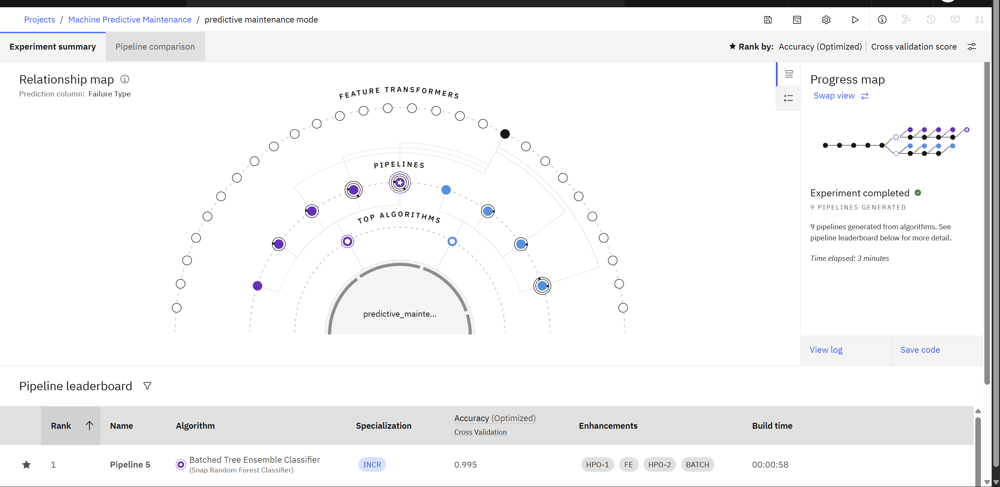

# 🛠️ Predictive Maintenance of Industrial Machinery

This project addresses **Problem Statement 39**: Predictive Maintenance of Industrial Machinery. The goal is to develop a model that predicts machinery failures in advance using sensor data, helping reduce downtime and maintenance costs.

---
# 🛠️ Outcome

 <!-- Replace with your actual image path -->

---


## 🔍 Problem Statement

Develop a predictive maintenance model for a fleet of industrial machines to anticipate failures before they occur. The model should classify different types of failures (e.g., tool wear, heat dissipation, power failure) using real-time sensor data.

> **Dataset Source**: [Kaggle - Predictive Maintenance Dataset](https://www.kaggle.com/datasets/shivamb/machine-predictive-maintenance-classification)

---

## 🧰 Technologies Used

- **IBM Watsonx.ai Studio**  
- **IBM Cloud Object Storage (COS)**  
- **Python (Jupyter Notebook)**  
- **Scikit-learn, Pandas, NumPy, Matplotlib, Seaborn**  
- **imbalanced-learn (SMOTE, RandomOverSampler)**  
- **ibm_boto3 (for COS integration)**

---

## ⚙️ System Setup

### System Requirements

| Component         | Specification                     |
|------------------|-------------------------------------|
| Cloud Platform   | IBM Watsonx.ai        |
| Storage          | IBM Cloud Object Storage (COS)     |
| Environment      | Python 3.11 (Jupyter Runtime)      |
| Notebook Tools   | Pandas, Scikit-learn, Matplotlib   |

### Required Libraries

```bash
pip install pandas numpy scikit-learn imbalanced-learn matplotlib seaborn ibm_boto3
```
## 📊 Project Workflow

### ✔️ Data Pipeline

#### **Data Ingestion**  
Loaded data securely from IBM Cloud Object Storage (COS) using `ibm_boto3`.

#### **Data Cleaning**  
Standardized column names, verified there were no missing or duplicate values.

#### **Stratified Train-Test Split**  
Ensured both training and testing datasets reflect the true class distribution using `train_test_split(stratify=y)`.

#### **Preprocessing**
- Applied `StandardScaler` to numeric features  
- Used `OneHotEncoder` for categorical features  
- Combined transformations using `ColumnTransformer`

#### **Class Balancing**  
Applied `RandomOverSampler` to the training data to address class imbalance (failure class under-represented).

#### **Model Training**  
Trained a `Snap Random Forest Classifier` on the resampled and preprocessed training data.

#### **Evaluation**  
Evaluated the model using:
- `accuracy_score`
- `confusion_matrix`
- `classification_report`

---

## 🧪 Results

| **Metric**              | **Value** |
|-------------------------|-----------|
| Accuracy                | 99.5%     |


---

## 🚀 Deployment

- The final model pipeline is **exportable as a model asset** from Watsonx.ai  
- Can be deployed as a **REST API endpoint on IBM Cloud** for real-time integration with industrial systems

---

## 🔭 Future Scope

- **Enhance Data**: Add more sensors like vibration, acoustic, and humidity  
- **Improve Models**: Try XGBoost, LightGBM, or ensemble techniques  
- **Edge Deployment**: Enable on-device prediction using IoT edge devices  
- **Scalability**: Extend the system to multiple machine types or factory environments  
- **Explainability**: Use SHAP or LIME for transparent and interpretable predictions

---

## 📁 Project Structure

```bash
📦 Predictive_Maintenance
├── 📓 notebook.ipynb         # Main notebook in Watsonx.ai
├── 📊 visualizations/        # Screenshots and charts
├── 📁 data/                  # Source CSV from IBM COS
├── 📄 README.md              # Project documentation

